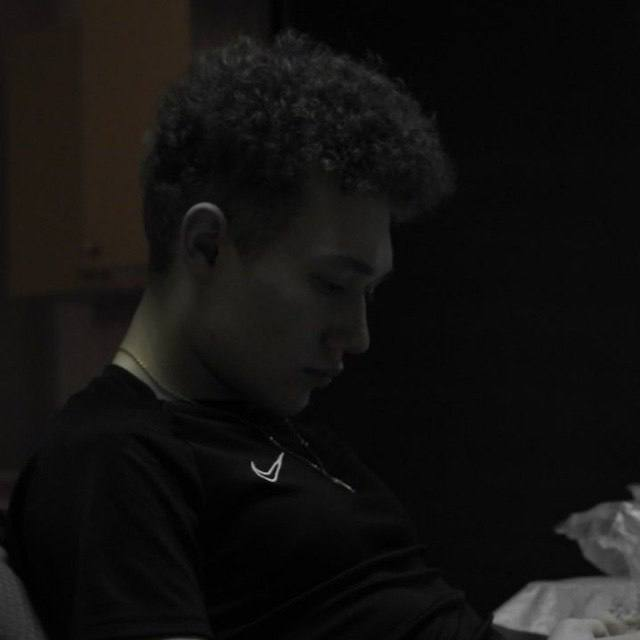

## 👋🏼 Hi! I'm Demchenko Danil



## About Me

I am a Frontend developer with hands-on experience in developing high-quality web applications. I am proficient in key technology stacks, including React, TypeScript, and Redux, with which I create user interfaces.

## Contact Information

- [Telegram](https://t.me/wasabully)
- [Gmail](mailto:danildemchenko.official@gmail.com)
- [Discord] wasabully

## Languages and Tools

- HTML, CSS, JavaScript, TypeScript, React

## Education

- **21 School by Sber**
- **KGEU** — Bachelor’s in Power Engineering and Electrical Engineering, Power Supply
- **KFU** — Master’s in Programming Engineering, IIRSI
- **English Level**: A2

## ✔️ Projects

- Here you can explore my projects on GitHub: [GitHub](https://github.com/wasabully)

## CodeWars Account

[](https://www.codewars.com/users/bessacoc)

## Code Example

```javascript
const createPhoneNumber = (numbers) => {
	let phoneFormat = '(xxx) xxx-xxxx';
	for (let i = 0; i < numbers.length; i++) {
		phoneFormat = phoneFormat.replace('x', numbers[i]);
	}
	return phoneFormat;
};
```
